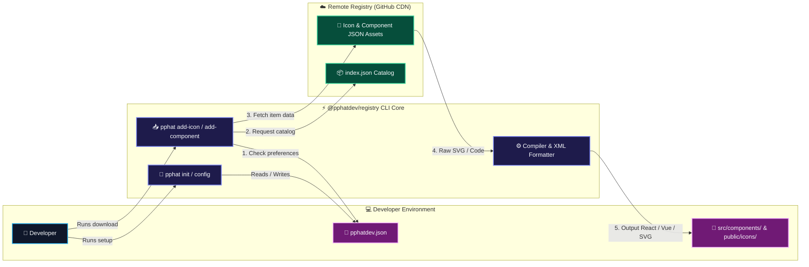
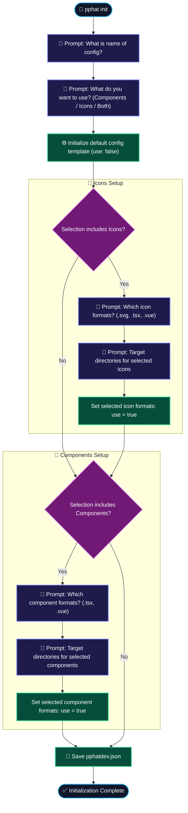
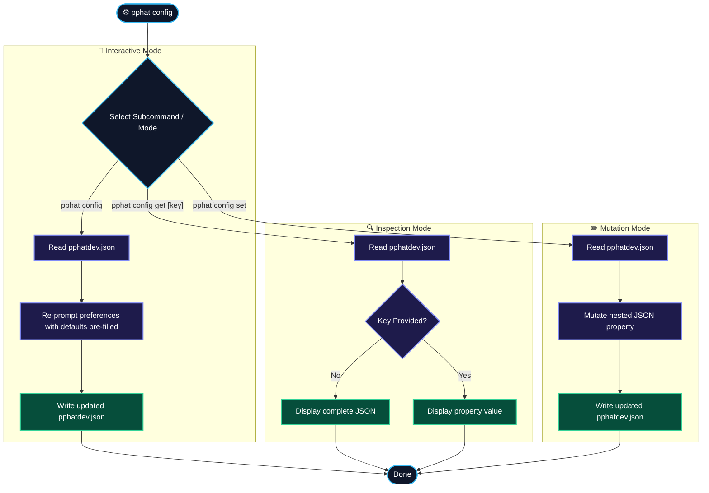
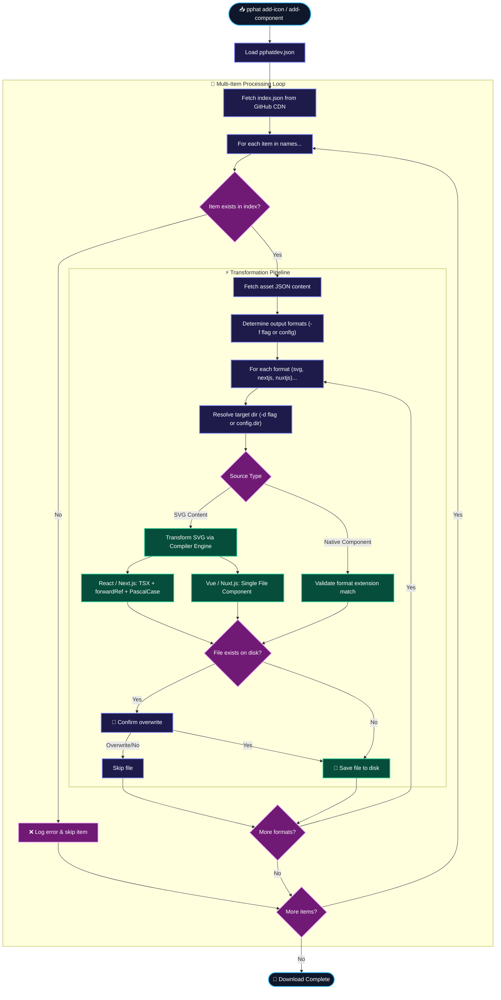
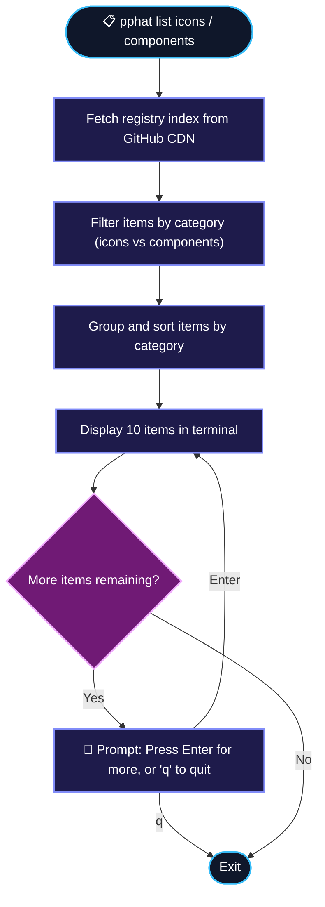
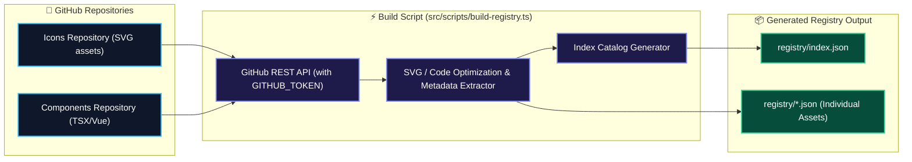

# @pphatdev/registry - System Architecture & Workflow

This document describes the complete system architecture, CLI command flows, and registry compilation process for `@pphatdev/registry`.

---

## 1. High-Level System Architecture

---

## 2. Interactive Initialization Flow (`pphat init`)

The `init` command sets up the default project configuration file (`pphatdev.json`) with all icon and component options pre-populated.

---

## 3. Configuration Management Flow (`pphat config`)

The `config` command allows users to view, interactively update, or programmatically set properties in `pphatdev.json`.

---

## 4. Download & Transformation Engine (`pphat add-icon` & `pphat add-component`)

Downloads one or multiple icons/components, applies framework transformations (SVG to React/Next.js `.tsx` or Vue/Nuxt.js `.vue`), and writes them to the project.

---

## 5. Registry Search & Listing Flow (`pphat list`)

Browses icons or components stored in the remote registry with paginated output.

---

## 6. Registry Builder Script Flow (`src/scripts/build-registry.ts`)

Converts source SVGs and components from GitHub repositories into optimized JSON entries served by the CDN.

